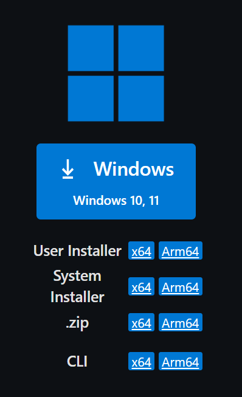
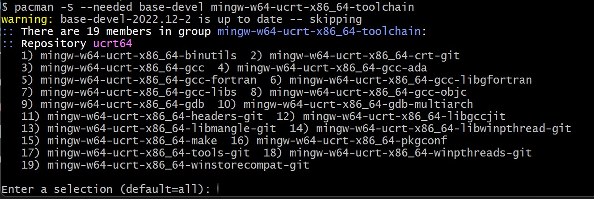
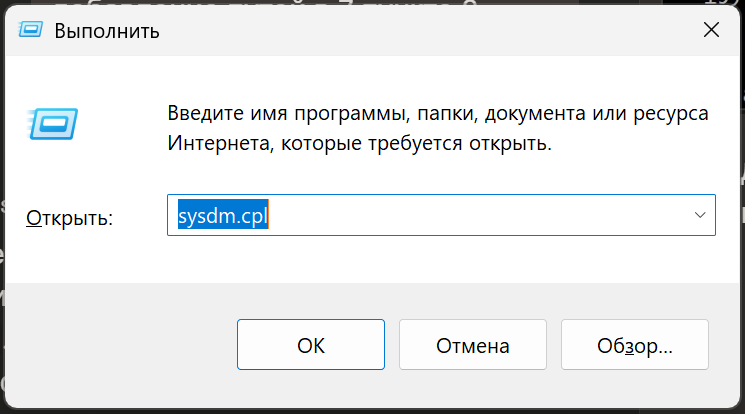
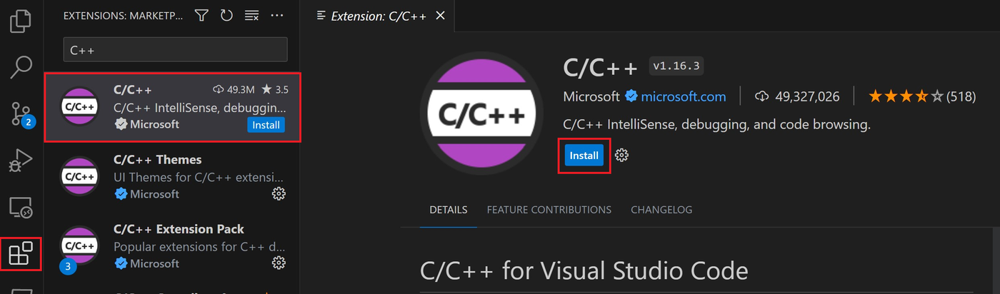
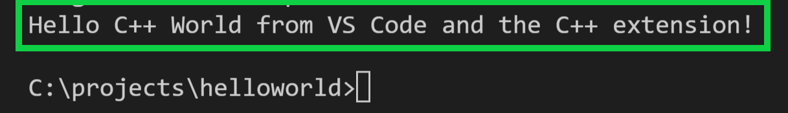
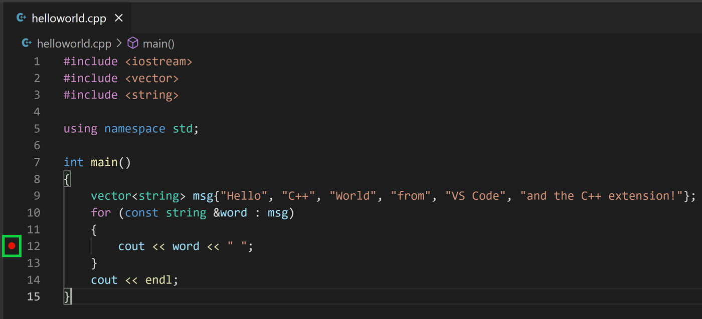
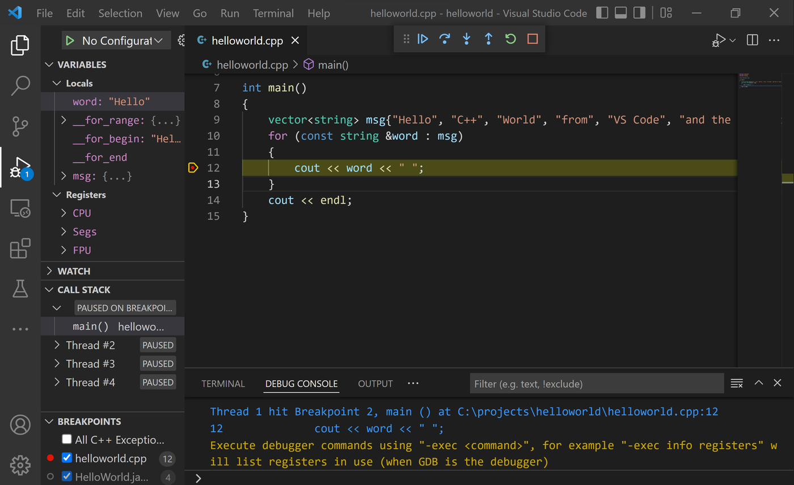
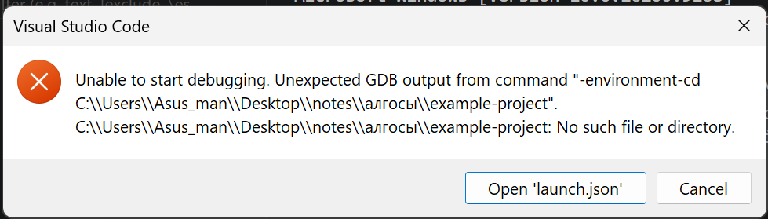

Это руководство предназначено для пользователей Windows и ожидает, что вы знакомы с тем, как устанавливать ПО в вашей системе.

Руководство основывается на [документации от Microsoft для настройки Visual Studio Code для работы с C/C++ на Windows с MinGW](https://code.visualstudio.com/docs/cpp/config-mingw) и нацелено на описание установки и настройки Visual Studio Code для C/C++ для решения задач по АиСД.

## Установка Visual Studio Code

Перейдите на [страницу загрузки](https://code.visualstudio.com/Download), выберите нужный вариант (зависит от используемой вами архитектуры) и установите его.



На скриншоте сверху большая синяя кнопка **Windows 10, 11** — это и есть **User Installer** для обычного пользователя. Также можно выбрать пункт **User Installer → x64** в списке ниже. Если у вас обычный процессор Intel/AMD (а не ARM, как в ноутбуках Snapdragon) — выбирайте именно **x64**, а не Arm64.

**ВАЖНО** Рекомендуется устанавливать именно вариант с сайта Microsoft. Это гарантирует совместимость с репозиториями расширений — в частности, наличие нужного расширения для C/C++.

## Установка компилятора и отладчика

В проверяющей системе используется компилятор **GCC**, потому рекомендуем использовать и установить именно его. Также, для отладки необходим собственно отладчик, для GCC соответствует **GDB**, потому далее будет устанавливаться именно он.

В Windows компилятор GCC и отладчик GDB удобнее всего получить через пакет **mingw-w64**, который распространяется посредством менеджера пакетов [MSYS2](https://www.msys2.org/).

Для этого:

1. Скачайте установщик MSYS2 со [страницы загрузки](https://www.msys2.org/) (или по [прямой ссылке](https://github.com/msys2/msys2-installer/releases/latest)) и запустите его.
2. Пройдите по шагам мастера установки. MSYS2 требует 64-битную Windows 10 (версия 1809 или новее). Выберите папку установки и запишите путь к ней — он пригодится дальше. Убедитесь, что отмечен пункт **Run MSYS2 now**, и нажмите **Finish** — откроется терминал MSYS2.
3. В терминале установите набор инструментов MinGW-w64 командой:

   ```bash
   pacman -S --needed base-devel mingw-w64-ucrt-x86_64-toolchain
   ```

   Примите количество пакетов по умолчанию (Enter) и введите `Y` для подтверждения установки:

   

4. Добавьте путь к папке `bin` в переменную среды `PATH` Windows. Быстрее всего это сделать через окно «Выполнить»:
   1. нажмите комбинацию клавиш **Win+R** — откроется окно «Выполнить»:

      

   2. в поле «Открыть:» введите команду и нажмите **OK** (или Enter):

      ```bat
      sysdm.cpl
      ```

   3. откроется окно **Свойства системы** (System Properties). В левом верхнем углу выберите вкладку **Дополнительно** (Advanced);
   4. в правом нижнем углу нажмите кнопку **Переменные среды...** (Environment Variables...);
   5. откроется диалог **Переменные среды**, где в разделе **Переменные пользователя** (User variables for...) выберите переменную `Path` и нажмите **Изменить...** (Edit...);
   6. нажмите **Создать** (New) и добавьте путь к папке установки. Если вы использовали настройки по умолчанию, это будет `C:\msys64\ucrt64\bin`;
   7. нажмите **OK** во всех открытых окнах, чтобы сохранить изменения. После этого нужно заново открыть окно консоли (см. ниже), чтобы обновлённый `PATH` вступил в силу.

> **Примечание.** Если у вас другая версия Windows (не 10/11) или команда `pacman` даёт ошибку, используйте вариант без UCRT:
> ```bash
> pacman -S --needed base-devel mingw-w64-x86_64-toolchain
> ```
> Тогда путь к папке `bin` будет `C:\msys64\mingw64\bin`.

### Что такое «окно консоли» и зачем его заново открывать

**Окно консоли** — это окно **Командной строки** (Command Prompt, сокращённо `cmd`). Это тёмное окно с текстовым приглашением (например, `C:\Users\имя>`), куда вводят текстовые команды. Именно в нём нужно будет выполнять проверочные команды (`gcc --version` и другие) из следующего раздела.

Ключевой момент: когда вы меняете переменную `PATH`, **уже открытые** окна командной строки **не узнают** об этом изменении — они продолжают работать со старым значением `PATH`. Поэтому обязательно сделайте так:

1. **Закройте** все ранее открытые окна командной строки (и окна PowerShell), если они у вас были открыты. Достаточно просто закрыть их — нажать крестик в правом верхнем углу окна.
2. **Откройте новое** окно командной строки одним из способов:
   - нажмите **Win+R**, введите `cmd` и нажмите **OK**; или
   - в поиске Windows (кнопка «Пуск») введите `cmd` или **Командная строка** и нажмите Enter.
3. Именно в этом **новом** окне выполняйте проверочные команды из следующего раздела.

Если вы этого не сделаете и оставите старое окно, то команда `gcc --version` может по-прежнему отвечать, что команда не найдена — хотя компилятор уже установлен. Не пугайтесь: просто закройте старое окно и откройте новое.

### Проверка установки

Откройте **новую** командную строку и проверьте установку следующими командами.

Проверка установки компилятора:

```bash
gcc --version
g++ --version
```

Проверка установки отладчика:

```bash
gdb --version
```

Должен быть приблизительно такой вывод с точными версиями:

```
gcc (RevX, Built by MSYS2 project) 15.2.0
```

Если `gcc` и `g++` выводят версию, а `gdb` — нет, значит отсутствует пакет **mingw-w64-gdb**: добавьте его той же командой `pacman -S ... mingw-w64-gdb`, либо повторно установите весь набор инструментов.

## Настройка Visual Studio Code

### Установка расширения для C/C++

Откройте Visual Studio Code.

Установите [расширение `C/C++`](https://marketplace.visualstudio.com/items?itemName=ms-vscode.cpptools).

Для этого откройте представление **Расширения** (Extensions): нажмите комбинацию клавиш **Ctrl+Shift+X** (или щёлкните значок расширений в левой боковой панели). В строке поиска введите `C++`, найдите расширение **C/C++** от Microsoft и нажмите кнопку **Install**:



### Возможные ошибки

#### В списке «Select a debug configuration» нет g++

При запуске отладки VS Code может показать список конфигураций, в котором есть только `clang++`, `clang-cl`, `cl.exe` из папки `D:\Drivers\LLVM\bin`, а `g++` отсутствует. Это не ошибка: расширение C/C++ показывает в этом списке **только те компиляторы, которые оно само обнаружило на системе**. Если оно нашло clang из LLVM, но не нашло g++ из MinGW — значит, оно «не видит» ваш обновлённый `PATH`.

Причины и решение:

1. **VS Code работает со старым `PATH`.** Если вы добавили путь `C:\msys64\ucrt64\bin` через «Переменные среды», а VS Code был запущен **до** этого, он продолжает использовать прежнее значение `PATH`. **Полностью закройте** все окна Visual Studio Code и откройте его заново. Затем в интегрированном терминале проверьте:

   ```bash
   g++ --version
   ```

   Если команда работает — значит, `PATH` обновился и g++ теперь виден.
2. **Явно укажите g++ как компилятор.** Нажмите **Ctrl+Shift+P** → введите **`C/C++: Select IntelliSense Configuration`** → Enter → выберите **`Use g++.exe`** (или `gcc`), если оно появилось в списке.
3. **Задайте отладчик вручную — самый надёжный способ.** Не полагайтесь на автоподбор: нажмите **Ctrl+Shift+P** → **`C/C++: Add Debug Configuration`** → выберите пункт со значком шестерёнки (например, **`(gdb) Launch`**), и замените содержимое файла `.vscode/launch.json` на готовый вариант из раздела «Отладка кода». Главное — чтобы в нём были поля `"MIMode": "gdb"` и `"miDebuggerPath": "C:\\msys64\\ucrt64\\bin\\gdb.exe"`. Тогда отладка будет запускать именно **g++ + GDB**, а не clang + LLDB.

### Настройка workspace’а

Создайте директорию и откройте её в Visual Studio Code, например через терминал (командную строку):

```bat
mkdir example-project
cd example-project
```

Для демонстрации создадим файл `helloworld.cpp`:

- Файл можно создать через кнопку `New File...` в explorer'е (может быть открыт с помощью комбинации клавиш Ctrl+Shift+E):

  

- После ввода имени файл появится в explorer'е:

  

Откроем созданный файл и введём примерный код:

```cpp
#include <iostream>
#include <vector>
#include <string>

using namespace std;

int main()
{
    vector<string> msg {"Hello", "C++", "World", "from", "VS Code", "and the C++ extension!"};

    for (const string& word : msg)
    {
        cout << word << " ";
    }
    cout << endl;

    return 0;
}
```

### Запуск кода

При текущей вкладке с файлом с исходным кодом будет активна кнопка с раскрывающимся меню `Run or Debug...` в правом верхнем углу редактора:


В раскрывающемся меню выберите `Run C/C++ File`:


Будет предложено автоматическое конфигурирование задачи для запуска файла — выбираем вариант с G++ и нажимаем Enter.

Внизу откроется терминал, в котором будет выполнена задача сборки и запущена скомпилированная программа:



Также, в директории `.vscode` появится файл `tasks.json` с приблизительно следующим содержанием:

```json
{
    "tasks": [
        {
            "type": "cppbuild",
            "label": "C/C++: g++.exe build and debug active file",
            "command": "C:\\msys64\\ucrt64\\bin\\g++.exe",
            "args": [
                "-fdiagnostics-color=always",
                "-g",
                "${file}",
                "-o",
                "${fileDirname}\\${fileBasenameNoExtension}.exe"
            ],
            "options": {
                "cwd": "${fileDirname}"
            },
            "problemMatcher": [
                "$gcc"
            ],
            "group": {
                "kind": "build",
                "isDefault": true
            },
            "detail": "Task generated by Debugger."
        }
    ],
    "version": "2.0.0"
}
```

Этот файл описывает задачу для сборки и исполнения текущего файла — теперь, чтобы запустить открытый файл, будет достаточно выбрать `Run C/C++ File` при нажатии треугольника сверху справа или через палитру команд.

### Возможные ошибки

#### Я не вижу файлы `tasks.json` / `launch.json` — где они лежат?

`tasks.json` и `launch.json` создаются **не в той папке, где появился `.exe`**, а в специальной служебной папке **`.vscode`**, которая находится **в корне рабочего пространства** — то есть в той папке, которую вы открыли в VS Code (через `File → Open Folder…` или `code .`), а не во вложенной папке с исходным файлом.

Правильная структура:

```text
<папка, которую вы открыли в VS Code>   ← это и есть workspace
├── .vscode\                            ← здесь искать JSON
│   ├── tasks.json
│   └── launch.json
└── example-project\                    ← здесь лежит код и появляется .exe
    ├── 1.cpp
    └── 1.exe
```

Как быстро проверить, что JSON на месте:

- **В проводнике VS Code:** нажмите **Ctrl+Shift+E** и раскройте папку **`.vscode`** в корне рабочего пространства — внутри будут `tasks.json` и `launch.json`.
- **В терминале:** поднимитесь из папки с кодом на уровень вверх и выполните:

  ```bat
  cd ..
  dir .vscode
  ```

  Если папка `.vscode` «не видна», посмотрите с показом скрытых файлов:

  ```bat
  dir /a .vscode
  ```

> **Если внутри `.vscode` пусто.** Файлы `tasks.json` и `launch.json` создаются **автоматически только когда вы запускаете файл кнопкой ▶** (Run C/C++ File / Debug C/C++ File). Если вы компилировали вручную в терминале (например, `g++ 1.cpp -o 1`), то `.exe` появится, а JSON-файлы не создадутся. В этом случае создайте папку `.vscode` и вручную положите туда `tasks.json` и `launch.json` из раздела «Отладка кода».

### Отладка кода

Поставим breakpoint на строке с оператором `cout`.

Для этого кликните ЛКМ слева от номера строчки:



Для запуска отладки выберите пункт `Debug C/C++ File` из раскрывающегося списка кнопки запуска:


Будет запущена отладка, а код остановится на строчке, где поставлен breakpoint:



Данное руководство не ставит целью описание процесса отладки и подразумевает изучение этого инструмента на практическом занятии или самостоятельно.

#### Если отладка не останавливается на нужных строчках

Запуску отладчика предшествует сборка исходного кода по задаче в файле `tasks.json`. Компилятор может оптимизировать код настолько, что некоторые строчки по факту не будут выполняться при запуске программы. Такое может произойти и в приведённом примере кода. Для отключения оптимизаций компилятора применим опцию `-O0`, прописав её в аргументах компилятора при сборке:

```json
{
    "tasks": [
        {
            "type": "cppbuild",
            "label": "C/C++: g++.exe build and debug active file",
            "command": "C:\\msys64\\ucrt64\\bin\\g++.exe",
            "args": [
                "-fdiagnostics-color=always",
                "-g",
                "${file}",
                "-O0",
                "-o",
                "${fileDirname}\\${fileBasenameNoExtension}.exe"
            ],
            "options": {
                "cwd": "${fileDirname}"
            },
            "problemMatcher": [
                "$gcc"
            ],
            "group": {
                "kind": "build",
                "isDefault": true
            },
            "detail": "Task generated by Debugger."
        }
    ],
    "version": "2.0.0"
}
```

#### Ошибка «Unable to start debugging. Unexpected GDB output from command "-environment-cd" ... No such file or directory»

Если при запуске отладки появляется ошибка вида:



```text
Unable to start debugging. Unexpected GDB output from command "-environment-cd
C:\Users\Asus_man\Desktop\notes\алгосы\example-project".
...\алгосы\example-project: No such file or directory.
```

Эта ошибка выглядит так, будто папки не существует, хотя она есть на диске. На самом деле проблема в том, что **в пути к проекту есть кириллица** (в примере — папка `алгосы`). Компилятор `g++` с этим справляется, а отладчик **GDB на Windows** — нет: он получает путь в неверной кодировке и «не находит» каталог. Это известная особенность GDB, связанная с не-ASCII-символами в пути.

> При этом сама программа компилируется и `.exe` создаётся — ломается только **отладка**.

**Как исправить (надёжнее всего).** Перенесите проект в папку с путём **без кириллицы** (только латиница):

1. Создайте папку с английским именем, например `C:\Users\Asus_man\Desktop\cpp` (или просто `C:\cpp`).
2. Скопируйте туда свой код и папку `.vscode`, чтобы получилось, например:

   ```text
   C:\Users\Asus_man\Desktop\cpp\example-project\
   ├── .vscode\
   │   ├── launch.json
   │   └── tasks.json
   └── 1.cpp
   ```

3. В VS Code: **File → Open Folder…** → выберите `C:\Users\Asus_man\Desktop\cpp\example-project` (не `алгосы`).
4. Запустите отладку снова (кнопка ▶ → **Debug C/C++ File**).

Теперь в пути нет `алгосы`, и GDB спокойно перейдёт в нужную папку. Иногда достаточно просто **переименовать** папку `алгосы` в латиницу (например, `algos`), но надёжнее вынести проект в отдельную ASCII-папку, чтобы кириллица не встречалась ни в одном из уровней пути.

**Запасной вариант.** Включить поддержку UTF-8 в самой Windows:

1. **Панель управления** → **Язык и региональные стандарты** → вкладка **Дополнительно** → кнопка **Изменить язык системы…**.
2. Отметьте галочку **«Бета-версия: использовать Юникод (UTF-8) для поддержки языка во всем мире»**.
3. Перезагрузите Windows и снова запустите отладку.

Это помогает в ряде случаев, но меняет системную локаль, поэтому предпочтительнее вариант с переносом проекта в ASCII-папку.
