## Предисловие

Это руководство предназначено для пользователей Linux и ожидает, что вы знакомы с тем, как устанавливать ПО на используемый вами дистрибутив.

Руководство основывается на [документации от Microslop для настройки Visual Studio Code для работы с C/C++ на Linux](https://code.visualstudio.com/docs/cpp/config-linux) и нацелено на описание установки и настройки Visual Studio Code для C/C++ для решения задач по АиСД.

## Установка Visual Studio Code

Перейдите на [страницу загрузки](https://code.visualstudio.com/Download), выберите нужный вариант (зависит от используемого вами дистрибутива и архитектуры) и установите его.

**ВАЖНО** Вы можете захотеть установить Visual Studio Code из репозиториев вашего дистрибутива. Скорее всего вы получите открытую сборку Visual Studio Code, а не от Microslop, в связи с чем могут возникнуть проблемы с репозиториями расширений - нужного расширения для C/C++ может не оказаться. Поэтому рекомендуется устанавливать именно вариант с сайта Microsoft. 


## Установка компилятора и отладчика

В проверяющей системе используется компилятор __GCC__, потому рекомендуем использовать и установить именно его. Также, для отладки необходим собственно отладчик, для GCC соответсвует __GDB__, потому далее будет устанавливаться именно он.

В зависимости от дистрибутива и репозиториев, команда и названия пакетов могут отличаться:

Для Debian-based дистрибутивов (Debian, Ubuntu, Mint и т.д.):
```bash
apt install build-essential gdb
```

Для Arch-based дистрибутивов (Arch Linux, Manjaro Linux, EndeavourOS, CachyOS и т.д.):
```bash
pacman -Sy base-devel gdb
```

Для Red hat-based дистрибутивов (Fedora и т.д.):
```bash
sudo dnf install gcc gcc-c++ gdb
```

Помните, что приведённые выше команды могут потребовать root прав, а значит и использования `sudo` или `doas`.

Вы можете проверить установку следующими командами:

Проверка установки компилятора:
```bash
gcc --version
```

Должен быть приблизительно такой вывод с точной версией:


Проверка установки отладчика:
```bash
gdb --version
```

Должен быть приблизительно такой вывод с точной версией:


## Настройка Visual Studio Code

### Установка расширения для C/C++

Откройте Visual Studio Code.

Установите [расширение `C/C++`](https://marketplace.visualstudio.com/items?itemName=ms-vscode.cpptools).

Для этого в Visual Studio Code вы можете нажать комбинацию клавиш crtl+P, чтобы открыть command palette, ввести следующую команду `ext install ms-vscode.cpptools` и нажать enter.

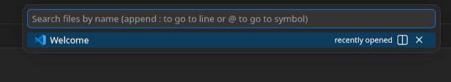


Слева откроется меню с раширениями, где будет найдено нужное расширение и будет устанавливаться:

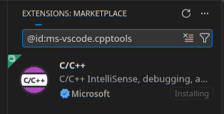

### Настройка workspace'а

Создайте директорию и откройте её в Visual Studio Code, например через треминал:
```bash
mkdir ./example-project
code ./example-project
```

Для демонстрации создадим файл `helloworld.cpp`:

- Файл можно создать через кнопку `New File...` в explorer'е (может быть открыт с помощью комбинации клавиш ctrl+shift+E):


- Потребуется ввести имя файла:

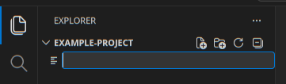

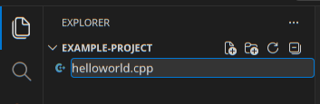

- Для завершения нажать enter:

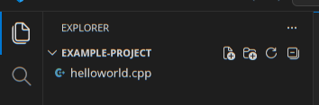

Откроем созданный файл и введём примерный код:
```cpp
#include <iostream>
#include <vector>
#include <string>

using namespace std;

int main()
{
    vector<string> msg {"Hello", "C++", "World", "from", "VS Code", "and the C++ extension!"};

    for (const string& word : msg)
    {
        cout << word << " ";
    }
    cout << endl;

    return 0;
}
```


### Запуск кода

При текущей вкладке с файлом с исходным кодом, будет активна кнопка с раскрвающимся меню `Run or Debug...`

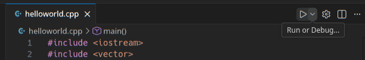

В меню будет две опции, выбираем `Run C/C++ File`:

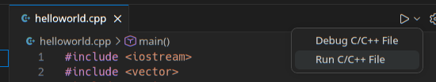

Будет предложено автоматическое конфигурирование задачи для запуска файла, выбираем вариант с G++ и нажимаем enter:

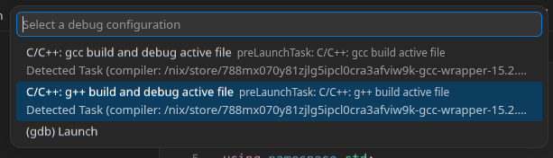

Внизу откроется два терминала, в одном из них будет выполнена задача сборки, а в другом запущена скомпилированная программа.

Также, в директории `.vscode` появится файл `tasks.json` с приблизительно следующим содержанием:
```json
{
    "tasks": [
        {
            "type": "cppbuild",
            "label": "C/C++: g++ build active file",
            "command": "/nix/store/788mx070y81zjlg5ipcl0cra3afviw9k-gcc-wrapper-15.2.0/bin/g++",
            "args": [
                "-fdiagnostics-color=always",
                "-g",
                "${file}",
                "-o",
                "${fileDirname}/${fileBasenameNoExtension}"
            ],
            "options": {
                "cwd": "${fileDirname}"
            },
            "problemMatcher": [
                "$gcc"
            ],
            "group": {
                "kind": "build",
                "isDefault": true
            },
            "detail": "Task generated by Debugger."
        }
    ],
    "version": "2.0.0"
}
```

Этот файл описывает задачу для сборки и исполнения текущего файла - теперь, чтобы запустить открытый файл, будет достаточно выбрать `Run C/C++ File` при нажатии треугольника сверху справа или через command palette.


### Отладка кода

Поставим breakpoint на 13 строчке исходного кода.

Для этого кликните ЛКМ слева от номера строчки:

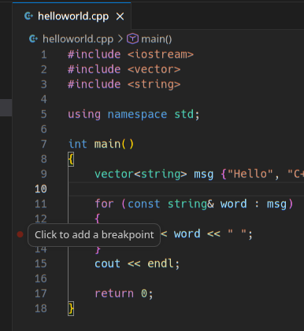

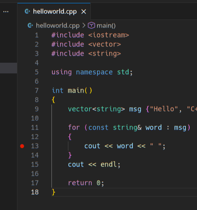

Для запуска отладки выберите пункт `Debug C/C++ File`:

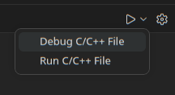

Будет запущена отладка, а код остановится на строчке, где поставлен breakpoint.

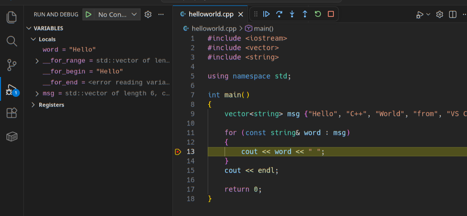

Данное руководство не ставит целью описание процесса отладки и подразумевает изучение этого инструмента на практическом занятии или самостоятельно.

#### Если отладка не останавливается на нужных строчках

Запуску отладчка предшествует сборка исходного кода по задаче в файле `tasks.json`. Компилятор может оптимизировать код настолько, что некоторые строчки по факту не будут выполняться при запуске программы. Такое может произойти и в приведённом примере кода. Для отключения оптимизаций компилятора, применим опцию `-O0`, прописав её в аргументах компилятора при сборке:
```json
{
    "tasks": [
        {
            "type": "cppbuild",
            "label": "C/C++: g++ build active file",
            "command": "/nix/store/788mx070y81zjlg5ipcl0cra3afviw9k-gcc-wrapper-15.2.0/bin/g++",
            "args": [
                "-fdiagnostics-color=always",
                "-g",
                "${file}",
                "-O0",
                "-o",
                "${fileDirname}/${fileBasenameNoExtension}"
            ],
            "options": {
                "cwd": "${fileDirname}"
            },
            "problemMatcher": [
                "$gcc"
            ],
            "group": {
                "kind": "build",
                "isDefault": true
            },
            "detail": "Task generated by Debugger."
        }
    ],
    "version": "2.0.0"
}
```