## Предисловие

Это руководство предназначено для пользователей macOS. Оно одинаково подходит и для Apple Silicon (M1/M2/M3/M4 и т.д., архитектура arm64), и для Intel Mac (x86_64) — почти все шаги ниже общие для обеих архитектур, отличия отмечены отдельно.

Руководство основывается на [документации от Microslop для настройки Visual Studio Code для работы с C/C++ на macOS](https://code.visualstudio.com/docs/cpp/config-clang-mac) и нацелено на описание установки и настройки Visual Studio Code для C/C++ для решения задач по АиСД.

## Установка Visual Studio Code

Перейдите на [страницу загрузки](https://code.visualstudio.com/Download) и скачайте вариант для macOS.

По умолчанию там предлагается **Universal**-сборка — она одна нативно работает и на Apple Silicon, и на Intel Mac, самим определять архитектуру не нужно. На той же странице есть отдельные сборки Intel chip / Apple silicon — они просто занимают меньше места на диске, но по функциональности не отличаются от Universal.

Скачается `.dmg`-файл: откройте его и перетащите иконку Visual Studio Code в папку `Applications`.

**Через Homebrew:** если у вас уже установлен Homebrew (см. ниже), то же самое можно сделать одной командой:
```bash
brew install --cask visual-studio-code
```

**ВАЖНО** В отличие от Linux, где сборки из репозиториев дистрибутива иногда оказываются не официальным Microsoft-билдом, `--cask visual-studio-code` в Homebrew скачивает ровно тот же официальный `.dmg` с сайта Microsoft. Так что здесь выбор между сайтом и Homebrew — вопрос удобства, а не другой сборки.

После установки удобно добавить команду `code` в `PATH`, чтобы открывать VS Code из терминала: откройте VS Code, через command palette (⌘+Shift+P) введите `Shell Command: Install 'code' command in PATH` и выполните её.

## Установка компилятора и отладчика

### Что уже есть по умолчанию

В отличие от Linux, на macOS для базовой компиляции ничего отдельно ставить не нужно — достаточно **Xcode Command Line Tools**, которые дают компилятор **Clang** (тот же тулчейн, что используется в Xcode). Проверить, установлены ли они:
```bash
xcode-select -p
```
Если команда вывела путь вроде `/Library/Developer/CommandLineTools`, всё уже стоит. Если получили ошибку — установите:
```bash
xcode-select --install
```
и следуйте инструкциям в открывшемся окне.

**Важный нюанс:** команды `gcc`, `cc`, `g++` на macOS на самом деле являются алиасами на Clang, а не настоящим GNU GCC:
```bash
gcc --version
```
```
Apple clang version 16.0.0 (clang-1600.0.26.6)
Target: arm64-apple-darwin24.0.0
Thread model: posix
```
Если присмотреться, там прямым текстом написано `Apple clang`, а не просто `gcc`. Для отладки Clang использует **LLDB** — тоже штатный инструмент macOS, отдельно ставить его не нужно.

Проверяющая система для задач по АиСД использует GCC (на Linux), но для учебного C++ разница между GCC и Clang в подавляющем большинстве случаев не ощущается — оба следуют стандарту, и код, который компилируется одним, почти всегда компилируется и другим. Если хочется прямо тот же компилятор, что и на проверке — поставьте настоящий GCC через Homebrew (см. ниже), но для большинства задач это избыточно.

**Про GDB:** его тоже можно поставить через Homebrew, но на macOS (особенно на Apple Silicon) он требует дополнительной ручной настройки — самоподписанного сертификата и прав в Keychain, иначе система не даст ему прицепиться к процессу для отладки. Возиться с этим не стоит: LLDB прекрасно работает "из коробки", и именно его VS Code настроит автоматически (см. раздел про отладку ниже).

### Homebrew

Homebrew — пакетный менеджер для macOS (аналог `apt`/`pacman` из мира Linux), пригодится не только для этого гайда. Команда установки одна и та же что для Apple Silicon, что для Intel:
```bash
/bin/bash -c "$(curl -fsSL https://raw.githubusercontent.com/Homebrew/install/HEAD/install.sh)"
```
Если Xcode Command Line Tools ещё не стоят, установщик сам предложит их поставить.

После установки Homebrew кладёт себя в разные места в зависимости от архитектуры:
- Apple Silicon (arm64): `/opt/homebrew`
- Intel (x86_64): `/usr/local`

В конце установки скрипт покажет одну-две команды, которые нужно выполнить один раз, чтобы добавить `brew` в `PATH` (обычно это добавление строчки в `~/.zprofile`) — просто скопируйте и выполните то, что он попросит. После этого проверьте:
```bash
brew --version
```

Если всё же хочется настоящий GCC (не алиас на Clang):
```bash
brew install gcc
```
Homebrew ставит его под версионированными именами, чтобы не конфликтовать с системным `gcc`, например `gcc-14`/`g++-14` (точная версия зависит от того, что актуально на момент установки):
```bash
gcc-14 --version
```

## Настройка Visual Studio Code

### Установка расширения для C/C++

Откройте Visual Studio Code.

Установите [расширение `C/C++`](https://marketplace.visualstudio.com/items?itemName=ms-vscode.cpptools).

Для этого в Visual Studio Code вы можете нажать комбинацию клавиш crtl+P, чтобы открыть command palette, ввести следующую команду `ext install ms-vscode.cpptools` и нажать enter.

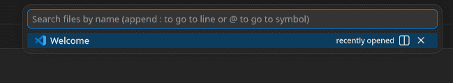


Слева откроется меню с раширениями, где будет найдено нужное расширение и будет устанавливаться:

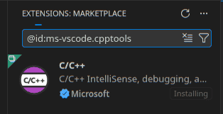

### Настройка workspace'а

Создайте директорию и откройте её в Visual Studio Code через терминал:
```bash
mkdir ./example-project
code ./example-project
```

Файл можно создать через кнопку `New File...` в explorer'е (⌘+Shift+E):


Потребуется ввести имя файла:

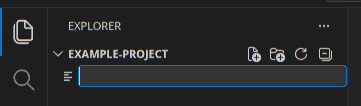

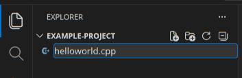

Для завершения нажать enter:

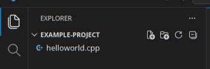

Откроем созданный файл и введём примерный код:

```cpp
#include <iostream>
#include <vector>
#include <string>

using namespace std;

int main()
{
    vector<string> msg {"Hello", "C++", "World", "from", "VS Code", "and the C++ extension!"};

    for (const string& word : msg)
    {
        cout << word << " ";
    }
    cout << endl;

    return 0;
}
```

## Запуск кода


При текущей вкладке с файлом с исходным кодом, будет активна кнопка с раскрвающимся меню `Run or Debug...`

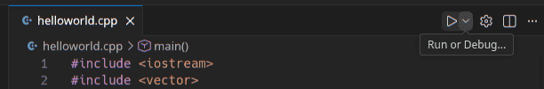

В меню будет две опции, выбираем `Run C/C++ File`:

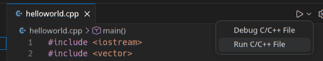

Будет предложено автоматическое конфигурирование задачи — выбираем вариант с **clang++** (что-то вроде `C/C++: clang++ build and debug active file`) и нажимаем enter. На macOS именно Clang будет обнаружен как компилятор по умолчанию — это ожидаемо и нормально, а не ошибка.

В директории `.vscode` появится файл `tasks.json` с примерно следующим содержанием:
```json
{
    "tasks": [
        {
            "type": "cppbuild",
            "label": "C/C++: clang++ build active file",
            "command": "/usr/bin/clang++",
            "args": [
                "-fcolor-diagnostics",
                "-fansi-escape-codes",
                "-g",
                "${file}",
                "-o",
                "${fileDirname}/${fileBasenameNoExtension}"
            ],
            "options": {
                "cwd": "${fileDirname}"
            },
            "problemMatcher": [
                "$gcc"
            ],
            "group": {
                "kind": "build",
                "isDefault": true
            },
            "detail": "Task generated by Debugger."
        }
    ],
    "version": "2.0.0"
}
```

Обратите внимание на `command`: `/usr/bin/clang++` — это системный Clang из Command Line Tools, и путь одинаковый что на Apple Silicon, что на Intel Mac (в отличие от Linux, где путь к компилятору может отличаться в зависимости от того, откуда он поставлен).

Этот файл описывает задачу сборки и исполнения текущего файла — теперь, чтобы запустить открытый файл, будет достаточно выбрать `Run C/C++ File` при нажатии треугольника сверху справа или через command palette.

## Отладка кода


Поставим breakpoint на 13 строчке исходного кода.

Для этого кликните ЛКМ слева от номера строчки:

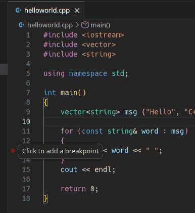

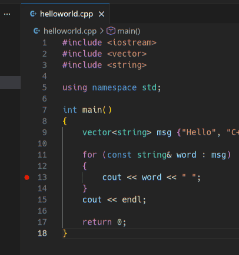

Для запуска отладки выберите пункт `Debug C/C++ File`. Расширение автоматически создаст `launch.json` с настройкой `"MIMode": "lldb"` — это значит, что отладчиком будет системный LLDB, никакой ручной установки или настройки GDB не требуется.

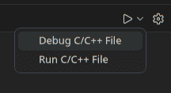

Будет запущена отладка, а код остановится на строчке, где поставлен breakpoint.

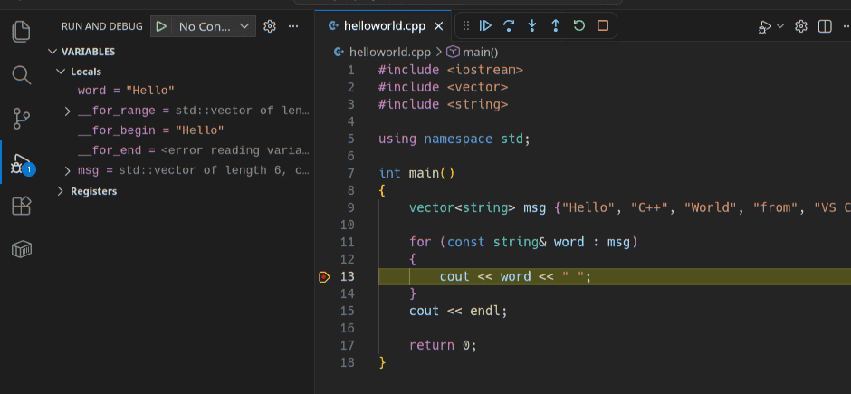

Данное руководство не ставит целью описание процесса отладки и подразумевает изучение этого инструмента на практическом занятии или самостоятельно.

### Если отладка не останавливается на нужных строчках

Как и на Linux, причина обычно в оптимизациях компилятора — часть строк по факту может не выполняться при запуске программы. Отключим оптимизации, добавив `-O0` в аргументы компилятора в `tasks.json`:
```json
{
    "tasks": [
        {
            "type": "cppbuild",
            "label": "C/C++: clang++ build active file",
            "command": "/usr/bin/clang++",
            "args": [
                "-fcolor-diagnostics",
                "-fansi-escape-codes",
                "-g",
                "${file}",
                "-O0",
                "-o",
                "${fileDirname}/${fileBasenameNoExtension}"
            ],
            "options": {
                "cwd": "${fileDirname}"
            },
            "problemMatcher": [
                "$gcc"
            ],
            "group": {
                "kind": "build",
                "isDefault": true
            },
            "detail": "Task generated by Debugger."
        }
    ],
    "version": "2.0.0"
}
```

## CLion вместо VS Code

Если хочется полноценную IDE вместо редактора с расширениями — CLion от JetBrains неплохо подходит: сам находит установленный Clang/GCC и CMake, из коробки умеет в отладку, рефакторинги, навигацию по коду и так далее. Правда, он тяжелее и медленнее VS Code, особенно на слабых машинах.

**Дисклеймер:** CLion платный, и в интернете легко найти пиратские репаки (условный "AppStorrent" и подобные сайты) — пользоваться ими не стоит: это нарушение лицензии, версии без патчей безопасности и вполне реальный риск словить малварь внутри скачанного `.dmg` — пиратский macOS-софт исторически один из популярных векторов для троянов, поскольку подписи и sandboxing у таких сборок обычно сломаны или отключены.

Вместо этого, как студент вы, скорее всего, имеете право на официальную бесплатную лицензию:
- Подайте заявку на [JetBrains Student Pack](https://www.jetbrains.com/shop/eform/students) — если ваш университетский email (`@niuitmo.ru` и т.п.) есть в их базе, лицензия на весь пакет IDE (включая CLion) выдаётся почти сразу.
- Если у вас уже есть [GitHub Student Developer Pack](https://education.github.com/pack), там тоже есть пункт с бесплатной лицензией JetBrains — можно оформить через него.

Лицензия действует, пока вы студент, и покрывает весь набор IDE от JetBrains, а не только CLion.
